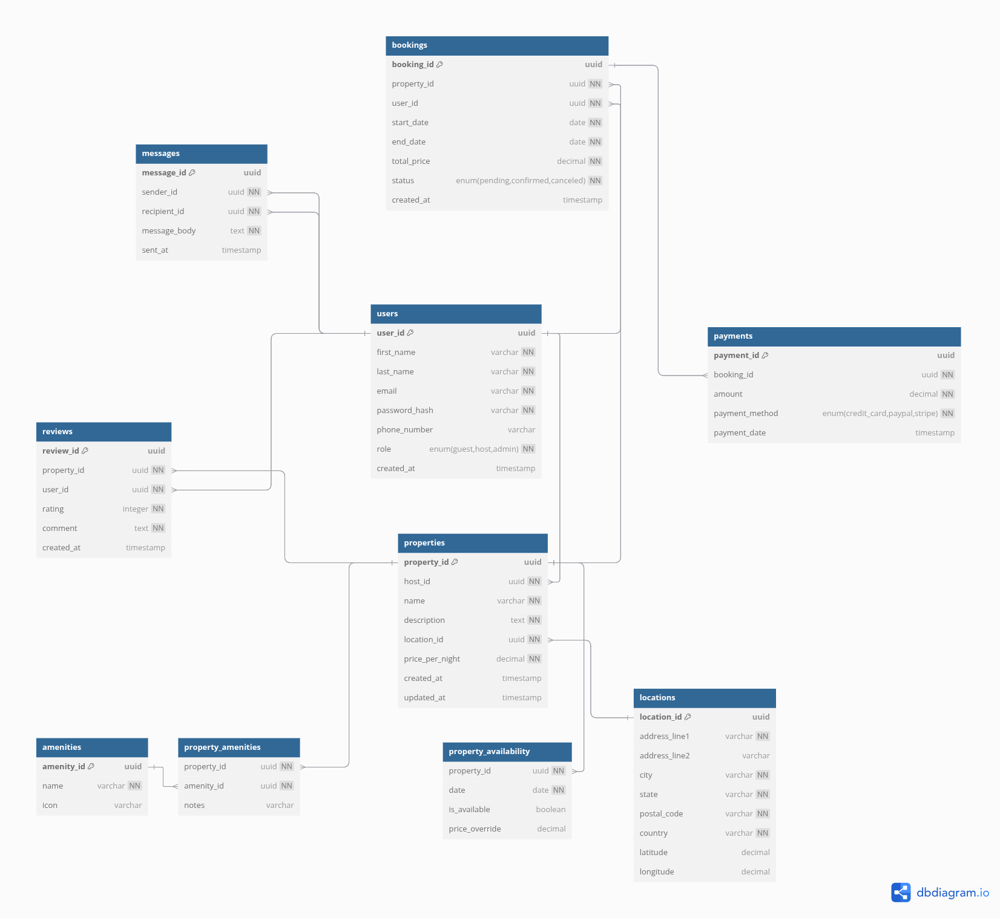

# Database Normalization To 3NF

## Initial Schema Assessment

#### Potential Issues:
1. **Partial key dependencies**: some tables combined multiple concepts
2. **Transitive Dependencies**: Derived attributes that could be moved
3. **Update anomalies**: Risk of inconsistent data in denormalized structures

### Normalization Steps
1. **First Normal Form (1NF)**

**Achieved by :**
- All tables have primary keys
- All Attributes contain atomic values
- No repeating groups

2. **Second Normal Form (2NF)**

**Action Taken :**
- Created amenities junction table
- Created property_availability table, separated dynamic availability from static property data
- Created locations table, removed transitive dependency, enables standardized location data

## Verification of 3NF
The final schema satisfies all 3NF requirements:

1. All tables satisfy 2NF

2. No non-prime attribute depends transitively on any candidate key

3. All functional dependencies are on candidate keys only

